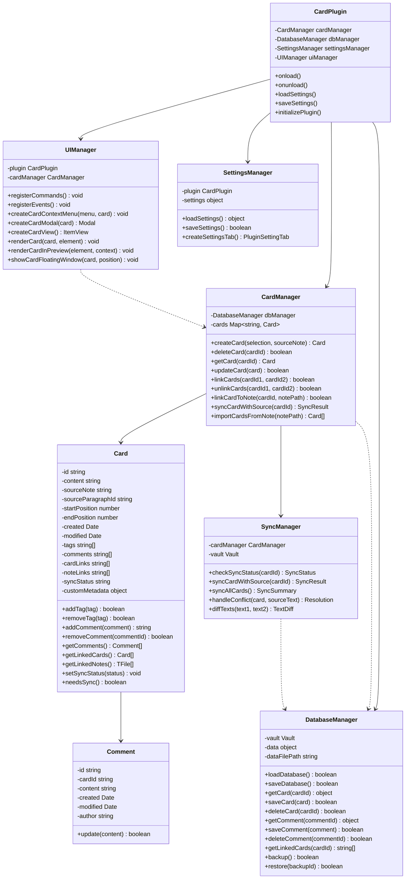

# Plugin Interaction Diagram

```mermaid
classDiagram
    class CardPlugin {
        -CardManager cardManager
        -DatabaseManager dbManager
        -SettingsManager settingsManager
        -UIManager uiManager
        +onload()
        +onunload()
        +loadSettings()
        +saveSettings()
        +initializePlugin()
    }
    
    class CardManager {
        -DatabaseManager dbManager
        -cards Map~string, Card~
        +createCard(selection, sourceNote) Card
        +deleteCard(cardId) boolean
        +getCard(cardId) Card
        +updateCard(card) boolean
        +linkCards(cardId1, cardId2) boolean
        +unlinkCards(cardId1, cardId2) boolean
        +linkCardToNote(cardId, notePath) boolean
        +syncCardWithSource(cardId) SyncResult
        +importCardsFromNote(notePath) Card[]
    }
    
    class Card {
        -id string
        -content string
        -sourceNote string
        -sourceParagraphId string
        -startPosition number
        -endPosition number
        -created Date
        -modified Date
        -tags string[]
        -comments string[]
        -cardLinks string[]
        -noteLinks string[]
        -syncStatus string
        -customMetadata object
        +addTag(tag) boolean
        +removeTag(tag) boolean
        +addComment(comment) string
        +removeComment(commentId) boolean
        +getComments() Comment[]
        +getLinkedCards() Card[]
        +getLinkedNotes() TFile[]
        +setSyncStatus(status) void
        +needsSync() boolean
    }
    
    class Comment {
        -id string
        -cardId string
        -content string
        -created Date
        -modified Date
        -author string
        +update(content) boolean
    }
    
    class DatabaseManager {
        -vault Vault
        -data object
        -dataFilePath string
        +loadDatabase() boolean
        +saveDatabase() boolean
        +getCard(cardId) object
        +saveCard(card) boolean
        +deleteCard(cardId) boolean
        +getComment(commentId) object
        +saveComment(comment) boolean
        +deleteComment(commentId) boolean
        +getLinkedCards(cardId) string[]
        +backup() boolean
        +restore(backupId) boolean
    }
    
    class UIManager {
        -plugin CardPlugin
        -cardManager CardManager
        +registerCommands() void
        +registerEvents() void
        +createCardContextMenu(menu, card) void
        +createCardModal(card) Modal
        +createCardView() ItemView
        +renderCard(card, element) void
        +renderCardInPreview(element, context) void
        +showCardFloatingWindow(card, position) void
    }
    
    class SettingsManager {
        -plugin CardPlugin
        -settings object
        +loadSettings() object
        +saveSettings() boolean
        +createSettingsTab() PluginSettingTab
    }
    
    class SyncManager {
        -cardManager CardManager
        -vault Vault
        +checkSyncStatus(cardId) SyncStatus
        +syncCardWithSource(cardId) SyncResult
        +syncAllCards() SyncSummary
        +handleConflict(card, sourceText) Resolution
        +diffTexts(text1, text2) TextDiff
    }
    
    CardPlugin --> CardManager
    CardPlugin --> DatabaseManager
    CardPlugin --> SettingsManager
    CardPlugin --> UIManager
    CardManager --> Card
    CardManager --> SyncManager
    Card --> Comment
    CardManager ..> DatabaseManager
    UIManager ..> CardManager
    SyncManager ..> DatabaseManager
```
